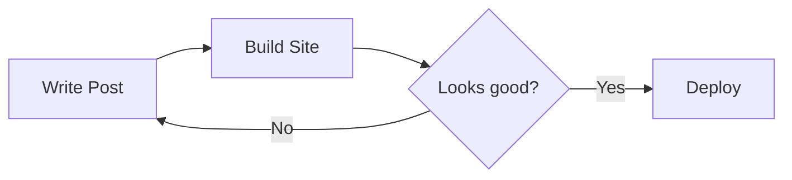

+++
title = "Hello, World!"
date = 2026-02-27
description = "My first blog post."
[taxonomies]
tags = ["hello"]
+++

Hello, world! This is my first blog post built with [Zola](https://www.getzola.org/) and the [Kita](https://github.com/st1020/kita) theme.

<!-- more -->

## Code

Here's a classic Hello World in a few languages:

```python
def greet(name: str) -> str:
    return f"Hello, {name}!"

if __name__ == "__main__":
    print(greet("World"))
```

```rust
fn main() {
    println!("Hello, World!");
}
```

## Math

Euler's identity, one of the most beautiful equations in mathematics:

$$e^{i\pi} + 1 = 0$$

The quadratic formula:

$$x = \frac{-b \pm \sqrt{b^2 - 4ac}}{2a}$$

## Diagrams

A simple flowchart built with Mermaid:




